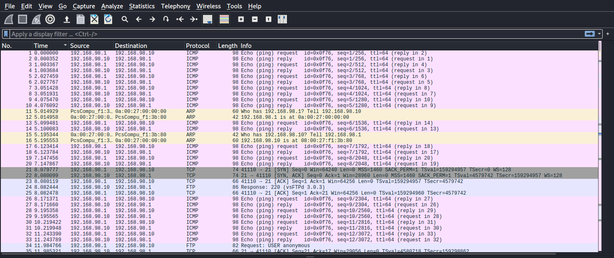

# Uchiha_CTF__Ttyhackme-writeup


## Make more order

Create a folder for this Challenge where all investigation files will be stored using `mkdir`, and then get into with `cd`

```bash
mkdir uchiha_folder
cd uchiha_folder
```
## Scanning the box 


Use `nmap` in order to scan the box :
 
```bash
nmap  -sC -sV 10.10.02.98 -oN nmap_scan.log

```
Seems like the box is up but blocking our ping probes,
so we have to use `-Pn`

```bash
nmap  -sC -sV -Pn 10.10.02.98 -oN nmap_scan.log
```

```
PORT   STATE  SERVICE  VERSION
20/tcp closed ftp-data
21/tcp open   ftp      vsftpd 3.0.3
| ftp-anon: Anonymous FTP login allowed (FTP code 230)
|_-rw-r--r--    1 ftp      ftp            69 Nov 05 13:03 test.txt
| ftp-syst: 
|   STAT: 
| FTP server status:
|      Connected to ::ffff:192.168.98.1
|      Logged in as ftp
|      TYPE: ASCII
|      No session bandwidth limit
|      Session timeout in seconds is 300
|      Control connection is plain text
|      Data connections will be plain text
|      At session startup, client count was 2
|      vsFTPd 3.0.3 - secure, fast, stable
|_End of status
22/tcp open   ssh      OpenSSH 7.2p2 Ubuntu 4ubuntu2.10 (Ubuntu Linux; protocol 2.0)
```

We can see that there is open ports `20,21,22`.
So ports `20 and 21` are for FTP, port `22` is for SSH. From `nmap`'s result we know that FTP service has anonymous-access enabled!
```
| ftp-anon: Anonymous FTP login allowed (FTP code 230)
```
## Explore the FTP service

Connect to the FTP service using this command-line client.

```
ftp 10.10.02.98
Connected to 10.10.02.98.
220 (vsFTPd 3.0.3)
Name (@.@.@.@:hisoka): anonymous
331 Please specify the password.
Password:
```


For anonymous  there is no password needed, so leave it empty and clic `Enter`

```
Password:
230 Login successful.
Remote system type is UNIX.
Using binary mode to transfer files.
ftp> 
```


We are in, so use `ls` to view the files.

```
ftp> ls
200 PORT command successful. Consider using PASV.
150 Here comes the directory listing.
-rw-r--r--    1 ftp      ftp          7372 Nov 05 19:19 message.txt
226 Directory send OK.

```

Interesting!! we found file named `message.txt`. It can be usefull, need to see it's content.
Get it with command `get`.

```
ftp> get message.txt
local: message.txt remote: message.txt
200 PORT command successful. Consider using PASV.
150 Opening BINARY mode data connection for message.txt (7372 bytes).
226 Transfer complete.
7372 bytes received in 0.00 secs (38.0026 MB/s)
ftp> 
```  

When returning to our folder `uchiha_folder`, we find the `message.txt` file. 
Using `cat` or `strings`  commands, we figure out that the file is a message from the admin.
This make as more curiouse to search for hidden things.


Now we have to acctivate `sharingan level 1` to see some hidden files.

Using `ls -a`  we can see all hidden files in the FTP's folder.

```
ftp> ls -a
200 PORT command successful. Consider using PASV.
150 Here comes the directory listing.
drwxr-xr-x    2 ftp      ftp          4096 Nov 05 19:30 .
drwxr-xr-x    2 ftp      ftp          4096 Nov 05 19:30 ..
-rw-r--r--    1 ftp      ftp         42490 Nov 05 19:29 .sniffing_test.file
-rw-r--r--    1 ftp      ftp          7372 Nov 05 19:29 message.txt
226 Directory send OK.
ftp> 

```

Yeah!! we found a file named `.sniffing_test.file`. Looks like a hidden file created while testing the box.

If we search about `sniffing tools` we find `wireshark`.   

Then here we go to `wireshark` to see the content.

```bash
wireshark .sniffing_test.file
```

We can deduce that was a pinging flood `ICMP` protocol, and other protocols.

 


When sorting the list by `protocol`, an `FTP-DATA` port`20` discussion between the server and the client. 

 


By Following the `TCP Stream` of the `FTP-DATA` protocol, we get something that looks like a `auth.log` file.

 


This is so interesting, now it's time to acctivate `sharingan level 2` and find usefull informations,
Yeah !!! found credentials `user:password`

```
itachi:W3_C@NT_S33_WH1L3_CL0S1NG_3Y3S

```


## Logging in with SSH credentials

As we saw SSH open port on this box, and `/home/itachi/.ssh` folder was created. So lets go try these credentials!!!

```bash
ssh itachi@10.10.02.98

```


